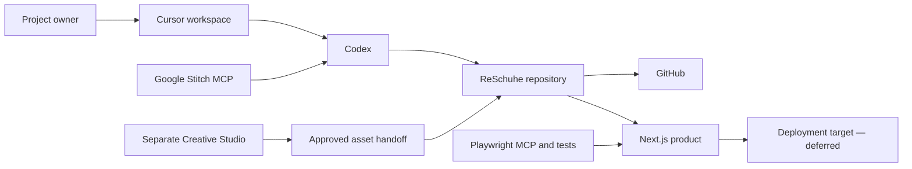

# ReSchuhe Architecture

Status: Foundation architecture confirmed; application architecture pending scaffold | Last reviewed: 2026-08-07

## System view

This diagram shows responsibility and handoff boundaries. Stitch concepts and Creative Studio outputs become product sources only after documentation and approval.

## Fixed technology baseline

| Concern | Decision |
| --- | --- |
| IDE | Cursor |
| Primary engineering agent | Codex |
| Source control | Git and GitHub |
| Package manager | pnpm |
| Runtime | Node version pinned by `.node-version` |
| Web framework | Next.js with TypeScript |
| Styling | Tailwind CSS using semantic design tokens |
| UI foundation | shadcn/ui, adapted to the ReSchuhe Design Baseline |
| Forms and validation | React Hook Form and Zod |
| Component development | Storybook |
| Browser automation | Playwright tests and Playwright MCP |
| UI concept generation | Google Stitch through MCP |
| Motion | Motion for normal UI behavior; GSAP for justified complex timelines |
| Creative production | Separate Creative Studio with approved-asset handoff |

Exact package versions are selected and locked during Stage 6; this document does not imply that packages are already installed.

## Source boundaries

### Repository

Owns application code, tests, documentation, design tokens, production component states, web-ready approved assets, and automation needed to build and verify the product.

### Creative Studio

Owns prompts, high-fidelity source media, editable files, experimental variants, model-specific workflows, and non-production outputs. It must not contain application secrets or become an undocumented dependency of the build.

### External tools and services

Provide bounded capabilities through explicit integrations. Their generated output, hosted state, or conversation history is not a substitute for repository documentation and versioned code.

## Planned application boundaries

Stage 6 will establish the concrete directory structure. The design must preserve these conceptual boundaries:

- Routes and layouts compose product journeys.
- Shared UI components implement the Design Baseline.
- Domain behavior is separated from presentation and external service adapters.
- Validation schemas are reusable at trust boundaries.
- Server-only operations and credentials remain inaccessible to browser bundles.
- Content and asset access patterns remain replaceable until the CMS decision is made.

No file-level architecture is approved before the scaffold exists.

## Quality attributes

- **Clarity:** a contributor can locate the source of a decision and the owner of a responsibility.
- **Accessibility:** semantic, keyboard-operable, readable behavior is designed into components.
- **Security and privacy:** untrusted input is validated and data collection is minimized.
- **Performance:** client JavaScript, media, fonts, and animation are budgeted deliberately.
- **Maintainability:** shared rules live in tokens, schemas, components, and tests rather than repeated page code.
- **Observability:** production diagnostics will be selected with privacy and ownership defined first.

## Deferred architecture decisions

- Hosting and deployment provider.
- Backend and persistence model.
- CMS and content workflow.
- Authentication and authorization.
- Commerce, booking, CRM, email, and other operational integrations.
- Analytics, consent, logging, monitoring, and incident tooling.
- Internationalization architecture.

Each decision must start from confirmed product requirements and include security, privacy, cost, ownership, and exit considerations.

## Decision records

Accepted decisions live in [`../adr/`](../adr/). The platform baseline is recorded in [`ADR-0001`](../adr/0001-codex-centered-development-platform.md).
