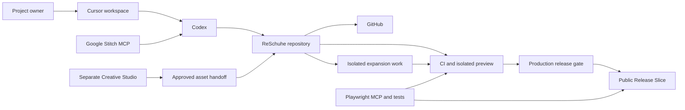

# ReSchuhe Architecture

Status: Foundation and progressive release architecture confirmed | Last reviewed: 2026-08-07

## System view

This diagram shows responsibility and handoff boundaries. Stitch concepts and Creative Studio outputs become product sources only after documentation and approval.
The Public Release Slice and expansion work remain parts of the same application; only release-ready
behavior crosses the production gate.

## Fixed technology baseline

| Concern                   | Decision                                                              |
| ------------------------- | --------------------------------------------------------------------- |
| IDE                       | Cursor                                                                |
| Primary engineering agent | Codex                                                                 |
| Source control            | Git and GitHub                                                        |
| Package manager           | pnpm                                                                  |
| Runtime                   | Node version pinned by `.node-version`                                |
| Web framework             | Next.js with TypeScript                                               |
| Styling                   | Tailwind CSS using semantic design tokens                             |
| UI foundation             | shadcn/ui, adapted to the ReSchuhe Design Baseline                    |
| Forms and validation      | Zod at the asset trust boundary; React Hook Form when a form needs it |
| Component development     | Storybook                                                             |
| Browser automation        | Playwright tests and Playwright MCP                                   |
| UI concept generation     | Google Stitch through MCP                                             |
| Motion                    | Motion for normal UI behavior; GSAP for justified complex timelines   |
| Creative production       | Separate Creative Studio with approved-asset handoff                  |

Installed packages use exact versions and a pnpm lockfile. The executable inventory and deliberate
dependency deferrals are recorded in
[`APPLICATION_FOUNDATION.md`](../engineering/APPLICATION_FOUNDATION.md).

## Source boundaries

### Repository

Owns application code, tests, documentation, design tokens, production component states, web-ready
Approved Assets, and automation needed to build and verify the product. Approved Asset versions
enter only through the validated handoff and live under `src/assets/approved/<asset-id>/v<version>/`.

### Creative Studio

Owns prompts, high-fidelity source media, editable files, experimental variants, model-specific workflows, and non-production outputs. It must not contain application secrets or become an undocumented dependency of the build.

The Studio-to-repository boundary is defined in
[`CREATIVE_STUDIO_WORKFLOW.md`](../creative/CREATIVE_STUDIO_WORKFLOW.md). The build never reads from
the external Studio; only sanitized, validated packages are imported into repository history.

### External tools and services

Provide bounded capabilities through explicit integrations. Their generated output, hosted state, or conversation history is not a substitute for repository documentation and versioned code.

## Application boundaries

- `src/app/` owns App Router routes, layouts, metadata, and global token wiring.
- `src/components/ui/` owns local shadcn-based primitives promoted into the Design Baseline.
- `src/lib/` owns shared implementation utilities that are independent of a route.
- `src/assets/approved/` owns immutable, versioned, sanitized production derivatives and manifests.
- `scripts/assets/` owns the validation and atomic import boundary for Creative Studio handoffs.
- `.storybook/` and colocated stories demonstrate component contracts outside product journeys.
- `e2e/` and colocated unit tests verify browser and component behavior.
- Future domain behavior must remain separate from presentation and external-service adapters.
- Future validation schemas must be reusable at trust boundaries.
- Server-only operations and credentials must remain inaccessible to browser bundles.
- Content and asset access patterns remain replaceable until the CMS decision is made.

The current route is a static technical status shell. It does not establish navigation, a commercial
offering, content architecture, or a launch journey.

## Progressive delivery boundaries

- The Public Release Slice is a complete vertical slice, not a separate landing-page codebase.
- `main` represents the exact production-ready history; `develop` may integrate release and isolated
  expansion work.
- Incomplete expansion behavior may exist only in bounded branches and previews. It cannot be
  reachable, indexed, or required by the public slice.
- A backend, CMS, authentication system, analytics service, or feature-control mechanism is selected
  only when a confirmed journey creates the need.
- Every added capability enters the public Product Experience through the same design promotion,
  test, security/privacy/legal, operational, and owner-approval gates.
- The delivery decision is recorded in
  [`ADR-0002`](../adr/0002-progressive-public-release.md).

## Quality attributes

- **Clarity:** a contributor can locate the source of a decision and the owner of a responsibility.
- **Accessibility:** semantic, keyboard-operable, readable behavior is designed into components.
- **Security and privacy:** untrusted input is validated and data collection is minimized.
- **Performance:** client JavaScript, media, fonts, and animation are budgeted deliberately.
- **Maintainability:** shared rules live in tokens, schemas, components, and tests rather than repeated page code.
- **Observability:** production diagnostics will be selected with privacy and ownership defined first.

## Pending architecture decisions

- Hosting, preview, and deployment provider for the Public Release Slice.
- Backend and persistence model.
- CMS and content workflow.
- Authentication and authorization.
- Commerce, booking, CRM, email, and other operational integrations.
- Analytics, consent, logging, monitoring, and incident tooling.
- Internationalization architecture.

Each decision must start from confirmed product requirements and include security, privacy, cost, ownership, and exit considerations.

## Decision records

Accepted decisions live in [`../adr/`](../adr/). The platform baseline is recorded in
[`ADR-0001`](../adr/0001-codex-centered-development-platform.md), and progressive public delivery is
recorded in [`ADR-0002`](../adr/0002-progressive-public-release.md).
